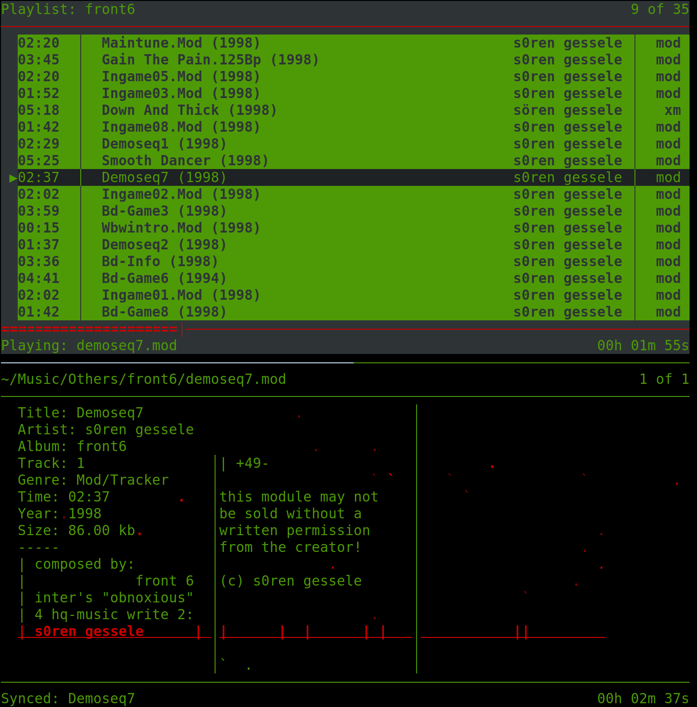

Mplay
===============================================================================
Full featured music player for the command line, inspired by cplay.
Released in 2025 by Unpythonic-coder, MIT License

 

So why another music player?
-------------------------------------------------------------------------------
Because I wanted a player that was similar to the classic cplay, but more visually appealing, with themes and screensavers, and  could play just about any audio file, including tracker formats and midi. And as a musician, I wanted a player that I could use to audition my own songs and samples, and then launch them directly into Audacity, Milkytracker, or LMMS.

 

Install Instructions (Mint/Ubuntu/Debian):
-------------------------------------------------------------------------------
1. Download and unzip 

2. Open a terminal in the mplay directory (mplay-main)

2. To make mplay executable, enter the command:

	    chmod 755 mplay

3. Install in usr/local/bin, or any other directory in your path:

	    sudo cp mplay /usr/local/bin/mplay

4. Install python-mpv, a neccessary dependancy:

	    sudo apt update
	    sudo apt install python3-mpv

	Note: if python3-mpv or python-mpv isn't in your repository, you can install via pip. But pip may not install all of MPVs dependancies.

5. If you want to use the included net_radio playlist, launch mplay once
(just type mplay and press ENTER) to automatically create the config 
directories, press 'Q' to quit, then copy net_radio.m3u:

	    cp net_radio.m3u ~/.config/mplay/playlists/net_radio.m3u
 

Optional Dependencies
-------------------------------------------------------------------------------
1. If you want midi support, you will need to install timidity:

	    sudo apt install timidity

	Note: On some distros, you may also need to manually install a soundfont and
set up a config file, but most Debian based distros will do it for you.

2. Music-tag is required if you wish to write audio tags from mplay. It is a
recommended install if you only wish to view tags. FFProbe (part of FFMPEG)
can display tags without music-tag, but it is slower (albeit more accurate)
than music-tag. If you care about metadata, I'd recommend using both;
music-tag will load tags faster while FFProbe will grab what it misses.

	    pip install music-tag

	Note: Some distros may require using the "--break-system-packages" flag to
properly install via pip. It's unlikely to actually break anything, but
use at your own risk.

3. If ffmpeg and ffprobe are not already installed, they can be installed via:

	    sudo apt install ffmpeg

3. If you wish to record Net Radio/Icecast Streams, install streamripper:

	    sudo apt install streamripper

4. The stat bar requires "psutil". It's likely installed on your system, but if not:

	    sudo apt install python3-psutil

5. If you have legacy audio files (before extensions became the norm), you may
wish to install python3-magic to check mime types rather than filter files by
extension. This can be slow, so only use if neccessary.

	    sudo apt install python3-magic

 

TROUBLESHOOTING INSTALL ISSUES
-------------------------------------------------------------------------------
1. When first playing a song, if you see random text referring to "conf.c",
you likely need to install the pipewire libraries:

	    sudo apt install pipewire-audio-client-libraries

2. If timidity is installed and a soundfont is installed/configured, but midi
files still won't play, you may need to install pulseaudio:

	    sudo apt install pulseaudio

 

BASIC USAGE
-------------------------------------------------------------------------------
To launch, type mplay in a terminal and press ENTER.
Press 'h' to toggle a list of frequently used commands.
Navigate with arrow keys and play music/change directories with ENTER.
Toggle between the Filelist and Playlist with TAB.
From the Filelist, press 'a' to append file(s) to the playlist.
Press 'q' to quit (after confirmation) or 'Q' to quit instantly.

To see a list of command line arguments/flags, run:

	    mplay --help

Change the default configuration by editing "~/.config/mplay/mplay.config"
in your favorite text editor. See [ABOUT_CONFIG.txt](ABOUT_CONFIG.txt)  for more information.
**Note that showing metadata is disabled by default.**

To sync multiple copies of mplay, launch one as the master (master is 
where you play music and apply color overrides):

	    mplay --master

And launch sync targets in different terminals (or same, if using tmux):

	    mplay --sync

For more complete instructions on using mplay, see [ABOUT_KEYBINDINGS.txt](ABOUT_KEYBINDINGS.txt) 

 

Crash Recovery
-------------------------------------------------------------------------------
In the unlikely event of a crash, or if you force quit mplay, you can stop any
zombie processes by running:

	mplay --kill

This should safely kill any background processes associated with mplay,
~~stop midi playback~~, and stop stream recording.
*Note: due to a bug, this flag no longer stops midi playback.*

If this is not effective, you can manually stop midi playback by running:

	pkill timidity

But make sure there are no other apps using timidity or it may cause them
to crash.

And the same goes for streamripper (if you were recording streams):

	pkill streamripper
